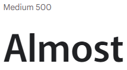
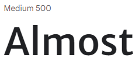

# KTCH - Control your Cupboards

KTCH is Brandon Firmstone's 4th project for Code Institute's Diploma in Software Development (E-commerce Applications).

KTCH is a kitchen stock management system for households. Sign up to KTCH and create your kitchen. Easily add all of the products that you want to keep a track of and keep on top of your kitchen.

The aim is to provide a modern solution to a modern problem. The audience is quite spread out, as I believe it will help those that love to organise and tidy their kitchen as well as those that abhor keeping organised. Young people might use the app to help keep themselves on track financially and to help reduce expensive bitty shopping trips.

## Table of contents

- [Project Concept](#project-concept)
  * [Project Goals](#project-goals)
  * [Project Features](#project-features)
- [UX Design](#ux-design)
  * [Wireframe Design](#wireframe-design)
    - [Home Page Wireframe](#home-page-design)
    - [Home Page Wireframe](#home-page-design)
    - [Home Page Wireframe](#home-page-design)
  * [Flowchart](#flowchart)
  * [Mock-up](#mock-up)
- [Features](#features)
  * [Initial Features Desired](#initial-features-desired)
  * [Implemented Features](#implemented-features)
  * [Unimplemented Features](#unimplemented-features)
  * [Future/Desired Features](#future-desired-features)
- [Testing](#testing)
  * [Bug Reporting Procedure](#bug-reporting-procedure)
  * [Validation Testing](#validation-testing)
  * [Cross-Browser and Cross-Device Testing](#cross-browser-and-cross-device-testing)
  * [Manual Testing](#manual-testing)
  * [Known Bugs](#known-bugs)
- [Accessibility](#accessibility)
  * [Lighthouse Audit](#lighthouse-audit)
  * [Testing](#testing-1)
  * [Issues](#issues)
- [Deployment](#deployment)
- [Credits](#credits)
  * [Credits for Content](#credits-for-content)
  * [Credits for Code](#credits-for-code)
  * [Credits for Media](#credits-for-media)
  * [Acknowledgements](#acknowledgements)

## Project Concept
### Project Goals

#### Business Goals

- Produce a useful service for users to track their kitchen stock
- Implement calls to action throughout to promote conversions (users creating accounts)

#### User Goals

- To track and manage food/ingredients in kitchen
- Help the user to save money 
- Help the user to keep organized
- Stop the user from running out of food

### Project Features

- Stock management system
  * Create products
  * Change stock levels
- User account creation
- Authorization required for certain services

## UX Design

### Colour Palette

### Fonts

Decided upon Merriweather Sans and Murecho from Google Fonts. Samples below:

#### Murecho

#### Merriweather

### Wireframe Design

The below are wireframe designs created using Balsamiq for individual pages on the site.
Each wireframe includes mobile and desktop views.

#### Home Page Design

 

#### Features Page Design

 

#### Stock Page Design

 

### Flowchart

### Mock-up

## Features

### Potential Business-related features
- Calls to action to promote conversions (visitors registering as users)
- Promoting features and unique selling points to users in a visually appealing fashion
- Making the site as easy as possible to add and maintain pages and features
- Legal information (Privacy policy, terms of service company details) need to be easily accessible
- Contacting the business needs to be easy for users in order to promote good customer service

### Potential User-related features
- Users would want to contact the company easily to fix any problems or make enquiries
- Easily register an account and access the stock system
- The site needs to be mobile friendly as users would want to access the system while moving around, for example going shopping, putting shopping away etc

### Features Desired
#### Features On All Pages
* A header should be included on all pages, identical throughout
  - When a user signs in, the header should reflect that the user is logged in
  - The header should include the company logo
  - The header should include navigation links to main pages
  - The header should include 'Log in' and 'Sign up' for easy access
* A footer should be included on all pages, identical throughout
  - The footer should include links to all main pages as well as any pages including legal information
  - The footer should display the company logo
  - The footer should include some company information (company name, registration number, VAT number)
  - The footer should include some contact details (address, email, phone number)

#### Home Page Features
* Home page should include a large call to action, similar to that on the wireframe

#### User Account System
  * Users should be able to create an account using their email address
  * Users should be able to amend account information
  * Users should be able to delete their account 
  
#### Stock Management System
  * Registered(Authorized) users should be able to create stock items
  * Registered users should be able to amend stock items they created
  * Registered users should be able to easily add and subtract from stock item quantity
  * Registered users should be able to attach images to stock items for easy identification

### Implemented Features

### Unimplemented Features

### Future/Desired Features

## Testing
### Bug Reporting Procedure

### Validation Testing

### Cross-Browser and Cross-Device Testing

### Manual Testing

### Known Bugs

## Accessibility
### Lighthouse Audit

### Testing

### Issues

## Deployment

## Credits
### Credits for Content

### Credits for Code

- Bootstrap: https://getbootstrap.com/
- JQuery: https://releases.jquery.com/

### Credits for Media

### UX Research Acknowledgements

While trying to decide upon fonts and colour palettes I researched the topic of kitchens and other similar solutions to better inform my design choices.

- https://www.goodhousekeeping.com/home/decorating-ideas/tips/g1644/colorful-kitchens/
- https://www.capterra.com/sem-compare/inventory-control-software/?utm_source=ps-google&utm_medium=ppc&gclid=Cj0KCQiA0eOPBhCGARIsAFIwTs4E2qVagpEIDa0mSNhcqnqdPkZvWv7cNT4mnnkiLXDL99prVMz9DvUaAhRhEALw_wcB
- https://coolors.co/ for palette generation

### Acknowledgements

- Table of contents generated with markdown-toc: https://ecotrust-canada.github.io/markdown-toc/
- Wireframes created using Balsamiq provided by Code Institute: https://balsamiq.com/
