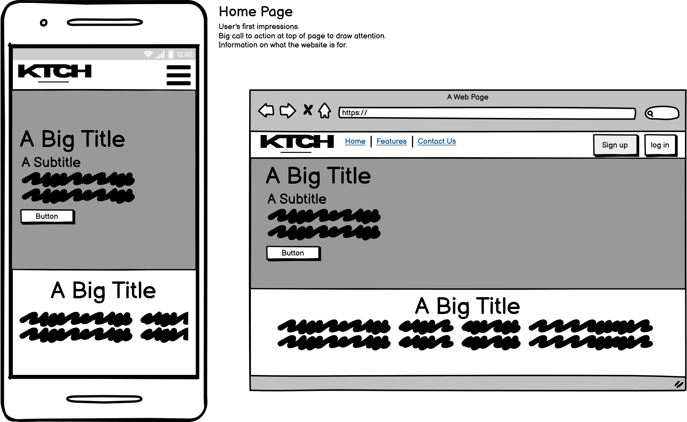
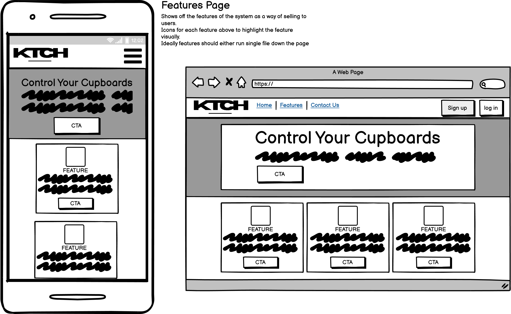
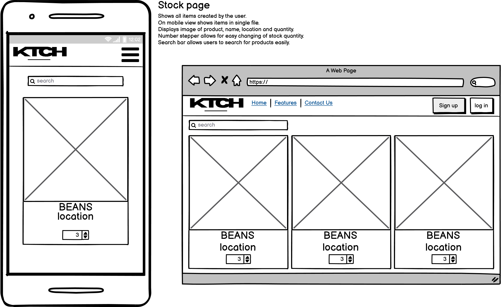

# KTCH - Control your Cupboards

KTCH is Brandon Firmstone's 4th project for Code Institute's Diploma in Software Development (E-commerce Applications).

KTCH is a kitchen stock management system for households. Sign up to KTCH and create your kitchen. Easily add all of the products that you want to keep a track of and keep on top of your kitchen.

The aim is to provide a modern solution to a modern problem. The audience is quite spread out, as I believe it will help those that love to organise and tidy their kitchen as well as those that abhor keeping organised. Young people might use the app to help keep themselves on track financially and to help reduce expensive bitty shopping trips.

## Table of contents

- [Project Concept](#project-concept)
  * [Project Goals](#project-goals)
  * [Project Features](#project-features)
- [UX Design](#ux-design)
  * [Wireframe Design](#wireframe-design)
    - [Home Page Wireframe](#home-page-design)
    - [Home Page Wireframe](#home-page-design)
    - [Home Page Wireframe](#home-page-design)
  * [Flowchart](#flowchart)
  * [Mock-up](#mock-up)
- [Features](#features)
  * [Initial Features Desired](#initial-features-desired)
  * [Implemented Features](#implemented-features)
  * [Unimplemented Features](#unimplemented-features)
  * [Future/Desired Features](#future-desired-features)
- [Testing](#testing)
  * [Bug Reporting Procedure](#bug-reporting-procedure)
  * [Validation Testing](#validation-testing)
  * [Cross-Browser and Cross-Device Testing](#cross-browser-and-cross-device-testing)
  * [Manual Testing](#manual-testing)
  * [Known Bugs](#known-bugs)
- [Accessibility](#accessibility)
  * [Lighthouse Audit](#lighthouse-audit)
  * [Testing](#testing-1)
  * [Issues](#issues)
- [Deployment](#deployment)
- [Credits](#credits)
  * [Credits for Content](#credits-for-content)
  * [Credits for Code](#credits-for-code)
  * [Credits for Media](#credits-for-media)
  * [Acknowledgements](#acknowledgements)

## Project Concept
### Project Goals

### Project Features

## UX Design

### Wireframe Design

The below are wireframe designs created using Balsamiq for individual pages on the site.
Each wireframe includes mobile and desktop views.

#### Home Page Design

 

#### Features Page Design

 

#### Stock Page Design

 

### Flowchart

### Mock-up

## Features
### Initial Features Desired

### Implemented Features

### Unimplemented Features

### Future/Desired Features

## Testing
### Bug Reporting Procedure

### Validation Testing

### Cross-Browser and Cross-Device Testing

### Manual Testing

### Known Bugs

## Accessibility
### Lighthouse Audit

### Testing

### Issues

## Deployment

## Credits
### Credits for Content

### Credits for Code

- Bootstrap: https://getbootstrap.com/
- JQuery: https://releases.jquery.com/

### Credits for Media

### Acknowledgements

- Table of contents generated with markdown-toc: https://ecotrust-canada.github.io/markdown-toc/
- Wireframes created using Balsamiq provided by Code Institute: https://balsamiq.com/
